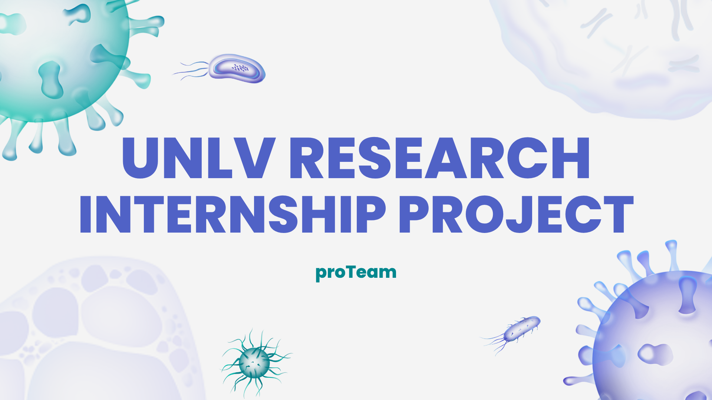
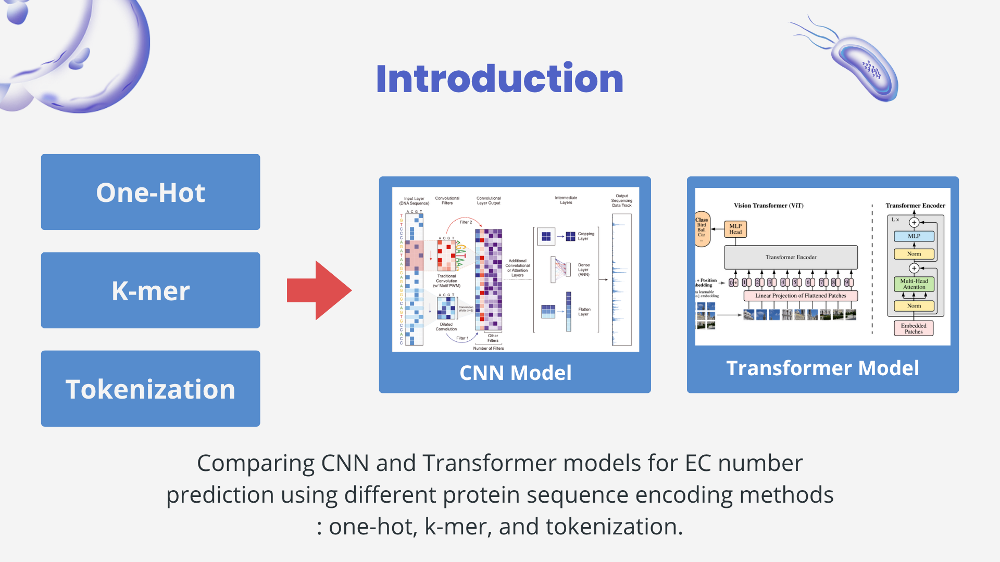
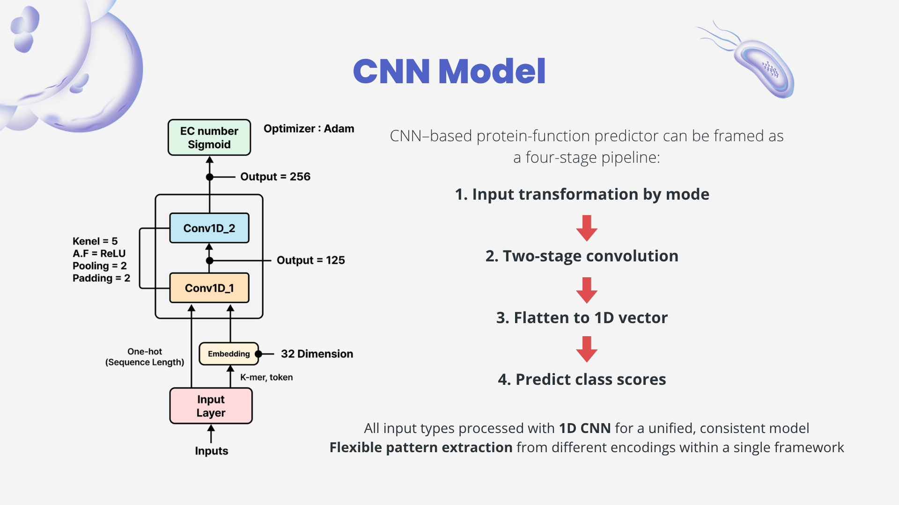
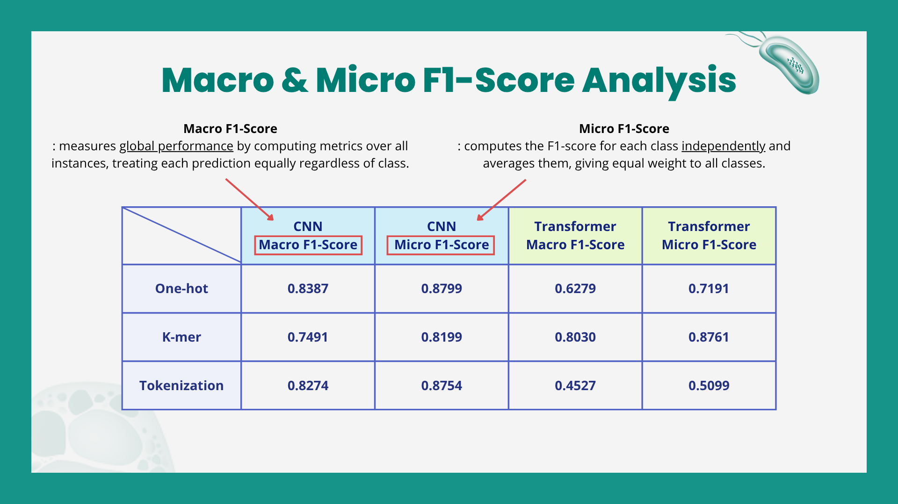

# 🧬 Protein Function Prediction using CNN

미국 University of Nevada, Las Vegas(UNLV) Summer Research Program에서 수행한 AI 기반 단백질 기능 예측 연구 프로젝트입니다.

본 연구에서는 단백질 서열의 다양한 인코딩 방식이 CNN과 Transformer 모델의 성능에 미치는 영향을 비교 분석하였습니다.

---

## 프로젝트 개요

### 프로젝트 정보

|항목|내용|
|---|---|
|프로젝트|Protein Function Prediction|
|기간|2025.06.22 ~ 2025.07.21 |
|프로그램|UNLV Summer Research Program|
|Framework|PyTorch|
|환경|Google Colab|
|모델|CNN, Transformer|

---

# 프로젝트 목표

기존 논문(ECPICK)에서 제안한 단백질 서열 인코딩 방식이 새롭게 설계한 CNN 모델에서도 동일한 성능 차이를 보이는지 검증하였습니다.

비교한 인코딩 방식

- One-hot Encoding
- K-mer Encoding
- Tokenization

비교 모델

- CNN
- Transformer

---

# 연구 흐름

단백질 서열을 다양한 방식으로 인코딩한 후 CNN과 Transformer 모델에 적용하여 성능을 비교하였습니다.

---

# 담당 역할

본 프로젝트에서는 다음 업무를 수행하였습니다.

- ECPICK 논문 분석
- One-hot Encoding 구현
- CNN 모델 설계 및 구현
- PyTorch 기반 학습 코드 작성
- 실험 결과 분석
- 최종 보고서 작성
- 영어 발표 진행

---

# CNN 모델

CNN 모델은 다양한 입력 방식에서도 동일한 구조를 사용할 수 있도록 설계하였습니다.

주요 구성

- Embedding Layer
- 1D Convolution Layer
- Max Pooling
- Fully Connected Layer
- Sigmoid Output

---

# 실험 결과

### 결과 요약

- CNN은 One-hot Encoding에서 가장 높은 성능을 보였습니다.
- Transformer는 K-mer Encoding에서 상대적으로 우수한 성능을 보였습니다.
- 전처리 방식에 따라 모델 성능 차이가 크게 발생함을 확인하였습니다.
- Macro F1과 Micro F1을 함께 비교하여 모델의 일반화 성능을 평가하였습니다.

---

# 기술 스택

- Python
- PyTorch
- Google Colab
- NumPy
- Pandas

---

# Repository

|파일|설명|
|---|---|
|CNN.ipynb|CNN 모델 구현 및 학습 코드|
|Final_Report.pdf|최종 연구 보고서|
|Final_Presentation.pdf|최종 발표 자료|

---

# 프로젝트를 통해 배운 점

이번 프로젝트를 통해 데이터 전처리 방식이 모델 성능에 큰 영향을 미친다는 점을 직접 확인할 수 있었습니다.

또한 논문의 결과를 단순히 재현하는 것이 아니라 다양한 실험을 설계하고 검증하는 과정을 경험하며 AI 연구의 전반적인 프로세스를 이해할 수 있었습니다.

실험 결과를 영어로 발표하고 보고서를 작성하며 연구 프로젝트 수행 경험도 함께 쌓을 수 있었습니다.
